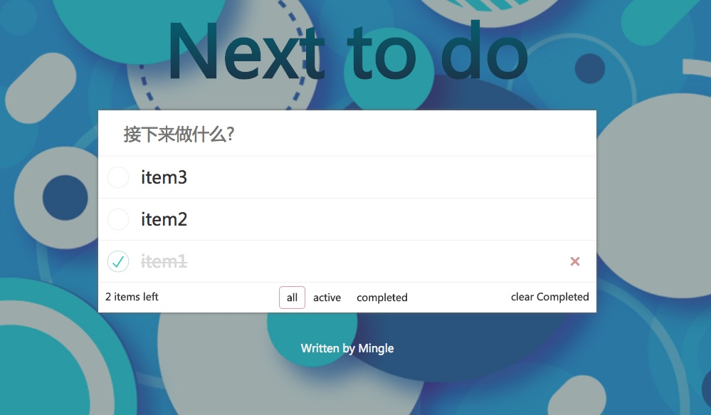

local-update-vue-todo
===

vue+Webpack4开发的单页面工具应用，实现todolist
增加、删除待办事项；
显示全部item，只显示已完成/未完成item，删除全部已完成item

开发技能
------
>* JavaScript 

>* Vue 2.0 : 组件开发，jsx、render

>* Webpack 4.25：Webpack-dev-server

>* styl ：CSS

博客
------
https://blog.csdn.net/MingleHDU/article/details/84113032

